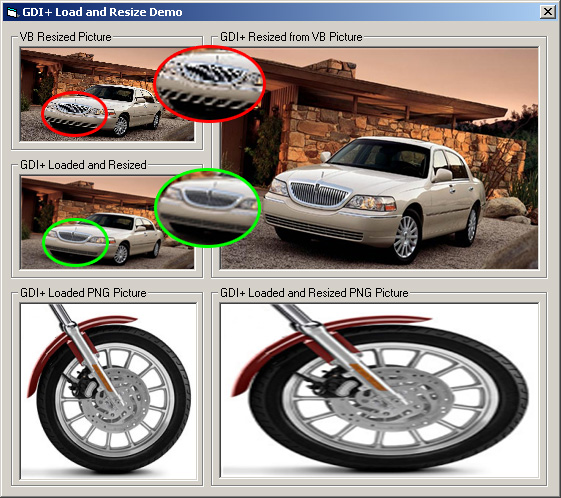



## Load and Resize Pictures with GDI\+

### Description

This module uses a combination of GDI+ and GDI API calls. Its functionallity is limited to loading images and resizing them. It can load all the picture formats supported by LoadPicture plus

the PNG file format.
 
### More Info
 
The module has two functions. LoadPictureGDIPlus and Resize. LoadPictureGDIPlus takes as parameters the filename, and optional desired width, height and backcolor if the picture is transparent. Resize takes as parameters the Picture handle, the picture type, desired width and height and an optional backcolor if the picture is transparent

To run this demo you need to have gdiplus.dll installed on your system.

XP users are fine since GDI+ is shipped with the OS. For any other Windows OS (not 95)

you can download the GDI+ redistributable from

http://download.microsoft.com/download/platformsdk/redist/3097/W98NT42KMeXP/EN-US/gdiplus_dnld.exe

Both functions return a new Bitmap Picture Object that can be directly set to a Picture property of a control.

The Resize function does not work with icon files (.ico and .cur).

             |
---                |---
**Submitted On**   |2003-09-09 13:55:34
**By**             |[Miltiadis Kritikos](https://github.com/Planet-Source-Code/PSCIndex/blob/master/ByAuthor/miltiadis-kritikos.md)
**Level**          |Advanced
**User Rating**    |5.0 (85 globes from 17 users)
**Compatibility**  |VB 6\.0
**Category**       |[Graphics](https://github.com/Planet-Source-Code/PSCIndex/blob/master/ByCategory/graphics__1-46.md)
**World**          |[Visual Basic](https://github.com/Planet-Source-Code/PSCIndex/blob/master/ByWorld/visual-basic.md)
**Archive File**   |[Load\_and\_R1643759102003\.zip](https://github.com/Planet-Source-Code/miltiadis-kritikos-load-and-resize-pictures-with-gdi__1-48352/archive/master.zip)

